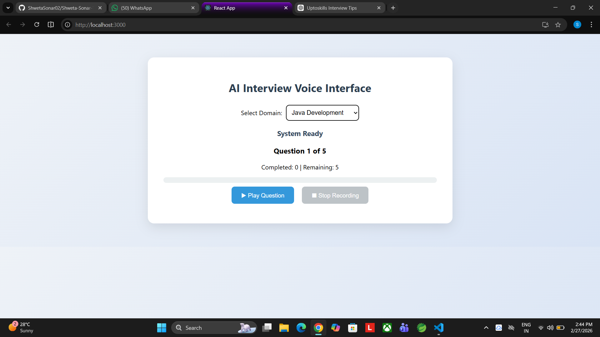

# 🎤 AI-Based Interview Voice Interface (Frontend)

A React.js-based Voice Interview Interface that simulates a real-time technical interview experience.

This module handles candidate interaction, question delivery, audio recording, and interview flow management.

---

## 📌 Project Overview

This system allows candidates to:

* Select an interview domain
* Receive audio-based interview questions
* Record voice responses using microphone
* Complete a structured interview session
* Track interview progress in real time

---

## 🚀 Key Features

* ✅ 10 Interview Domains
* ✅ 40 Questions per Domain
* ✅ Random Selection of 10 Questions
* ✅ Dynamic Question Shuffling
* ✅ Automatic Audio Playback
* ✅ Voice Recording via MediaRecorder API
* ✅ Interview Progress Tracking
* ✅ Controlled Interview Flow
* ✅ Backend Integration (Speech-to-Text)

---

## 🆕 🔥 Latest Update (Task 2 Integration)

This frontend is now successfully integrated with the backend Speech-to-Text system.

### ✅ New Enhancements:

* 🎤 Recorded audio is sent to Flask backend
* 🧠 Speech is converted into text using STT
* 📄 Transcribed answer is displayed on UI
* ⚠️ Handles silent / empty audio inputs
* 🔁 Improved user experience with error handling

---

## 🧠 Interview Workflow

1. Candidate selects a domain
2. System loads question bank
3. 10 questions are randomly selected
4. Audio question is played
5. Recording starts automatically
6. Answer is recorded and sent to backend
7. Speech is converted into text
8. Text is displayed on UI
9. System moves to next question

---

## 🏗️ Architecture Overview

### 🔹 Frontend Responsibilities

* Domain Selection
* Question Randomization
* Audio Playback
* Voice Recording
* API Communication (Backend)
* Progress Tracking

### 🔹 Backend Integration

* Speech-to-Text Conversion (Flask)
* Audio Processing (WebM → WAV)
* Google Speech Recognition API

---

## 🛠️ Technology Stack

* React.js
* JavaScript (ES6+)
* MediaRecorder API
* HTML5 Audio API
* CSS

---

## 📂 Project Structure

```id="h8u2ka"
Task1-Frontend/
│
├── public/
│   ├── audio/                  # Question audio files
│   ├── index.html
│
├── src/
│   ├── App.js                  # Interview logic + API integration
│   ├── DomainSelect.js
│   ├── App.css
│   ├── index.js
│
├── screenshots/
├── package.json
└── README.md
```

---

## 🚀 How to Run

```bash id="o0tqtx"
npm install
npm start
```

Open:
http://localhost:3000

---

## ⚠️ Important Notes

* 🎙️ Allow microphone permissions
* 🌐 Backend server must be running
* 🔗 API endpoint: http://127.0.0.1:5000/speech-to-text

---

## 🔮 Future Enhancements

* AI-based answer evaluation
* Score generation
* Cloud storage
* Timer-based questions
* Admin panel

---

## 📸 Screenshots

### 🔹 Domain Selection



### 🔹 Voice Interface


### 🔹 Progress Tracking


---

## 👩‍💻 Developed By

**Shweta Sonar**
MCA Student | Full Stack Java Developer