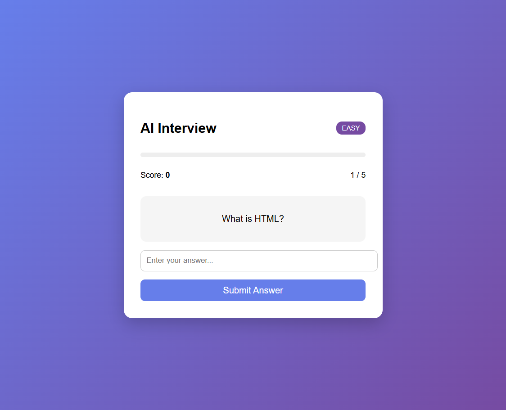
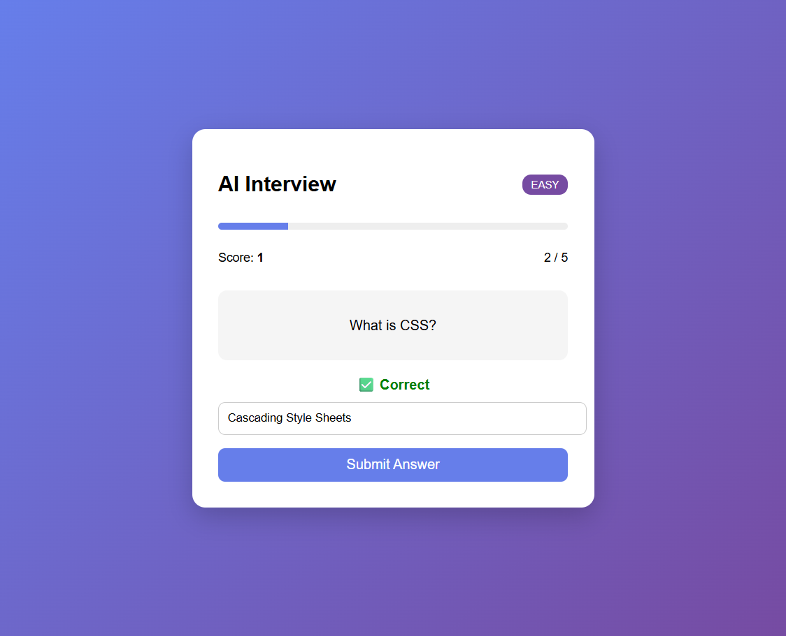
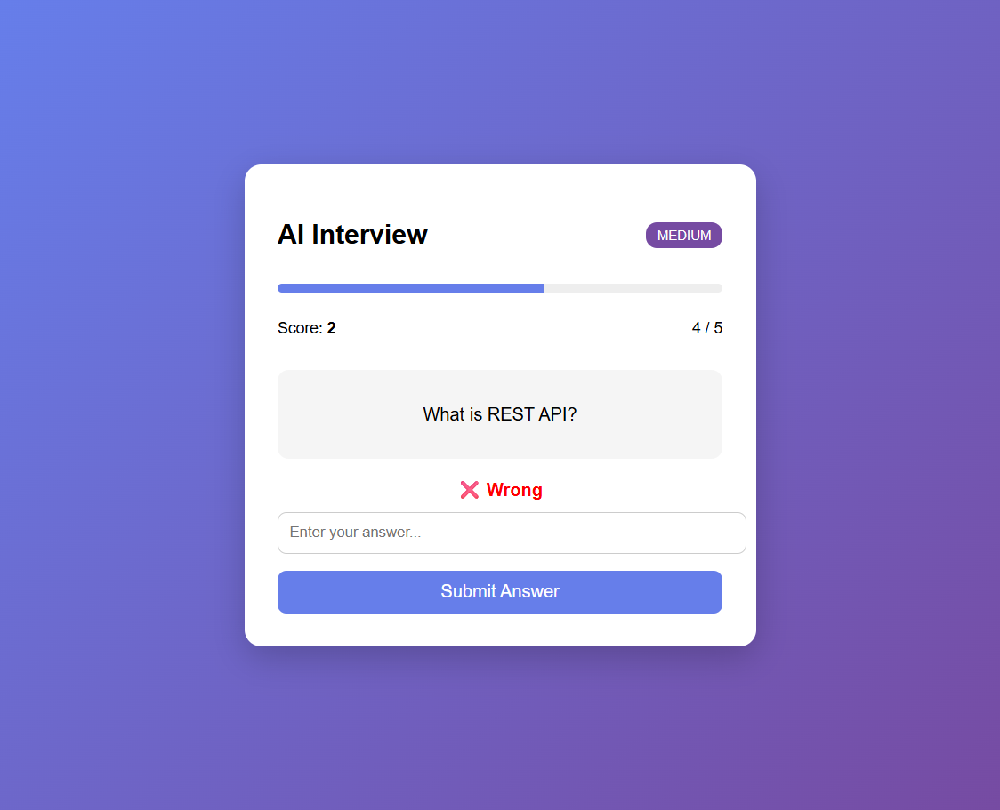
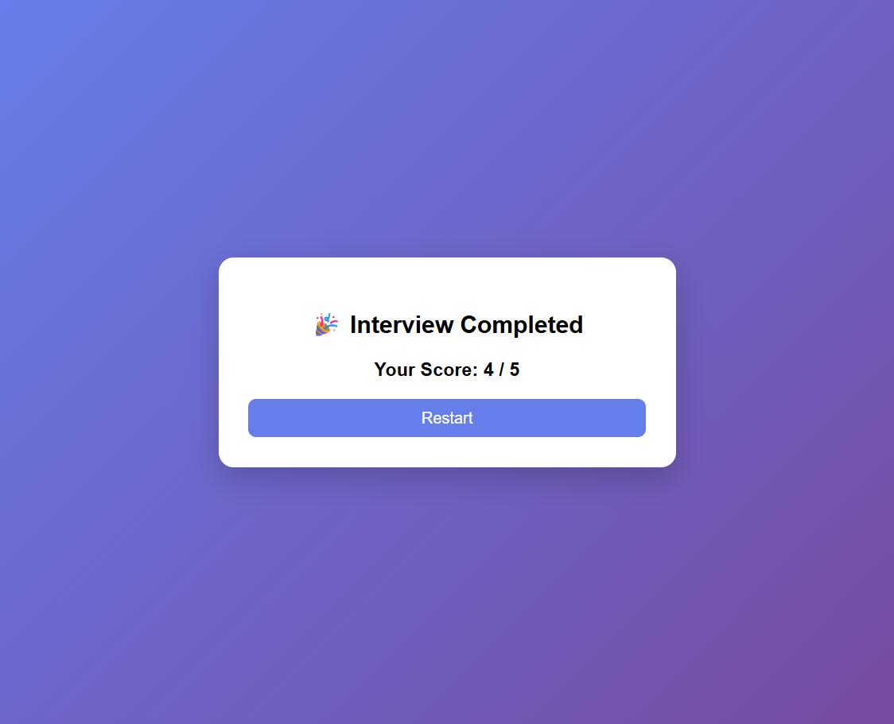

# 🤖 AI Interview System – Difficulty Progression Strategy

> Internship Task 3 – Difficulty Progression Design

---

## 📌 Task Overview

This project is a **web-based AI Interview System** that dynamically adjusts question difficulty based on user performance.

The system ensures:

* Smooth progression of difficulty
* No repeated questions
* Fair and structured interview flow

---

## 🌐 Live Demo

🔗 Coming Soon (Will be deployed on Vercel)

---

## 🚀 Features

- 🎯 Adaptive Difficulty (Easy → Medium → Hard)
- 🔁 No Question Repetition
- ⚡ Instant Feedback (Correct / Wrong)
- 🧠 Partial Answer Matching
- 📊 Score Tracking & Progress Bar
- 🔄 Structured Question Flow (Q1 → Q5)
- 🎉 Final Result Screen with Restart Option

---

## 🛠️ Tech Stack

* ⚛️ React.js (Frontend)
* 🎨 CSS (Styling)
* 📦 Create React App

---

## 📂 Project Structure

```
Task3-Interview/
├── public/
├── src/
│ ├── components/
│ │ ├── Interview.jsx
│ │ └── Interview.css
│ │
│ ├── data/
│ │ └── questions.js
│ │
│ ├── utils/
│ │ └── difficulty.js
│ │
│ ├── App.js
│ └── index.js
│
├── screenshots/
│ ├── start.png
│ ├── correct.png
│ ├── wrong.png
│ └── result.png
│
├── package.json
└── README.md
```

---

## ⚙️ Installation & Setup

1. Clone the repository

```bash
git clone https://github.com/ShwetaSonar02/AI-Project.git
cd AI-Project/Task3-Interview
npm install
npm start
```

---

## 📊 How It Works

1. User answers a question
2. System evaluates answer
3. Difficulty is adjusted:

   * Correct → Move up
   * Wrong → Move down
4. Next question is selected (no repetition)
5. Process repeats for 5 questions
6. Final score is displayed

---

## ⚠️ Constraints Handled

* ❌ No sudden jump (Easy → Hard)
* ❌ No repeated questions
* ✅ Handles partial correctness
* ✅ Maintains smooth progression

---

## 📸 Screenshots

### 🟢 1. Interview Start (Easy Level)
User starts the interview with an easy-level question. The system displays question count, score, and difficulty level.


---

### ✅ 2. Correct Answer Feedback
When the user submits a correct answer, the system provides instant feedback and increases the score.



---

### ❌ 3. Wrong Answer Handling
If the answer is incorrect, the system shows feedback and adjusts difficulty accordingly.



---

### 🎉 4. Interview Completion Screen
After completing all questions, the system displays the final score with an option to restart.



---

## 🧠 Future Enhancements

* 🎤 Voice-based answers
* 🤖 AI-based answer evaluation
* 📊 Performance analytics dashboard
* 🗄️ Database integration (MySQL)
* 🌐 Backend (Spring Boot / Node.js)

---

## 👩‍💻 Author

**Shweta Sonar**  
🎓 MCA Student (2024–2026)  
💻 Full Stack Java Developer  

🔗 GitHub: https://github.com/ShwetaSonar02

---
